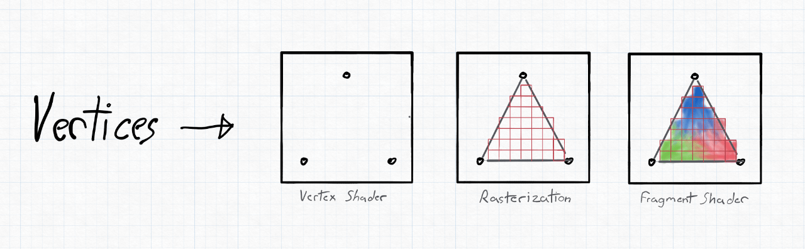
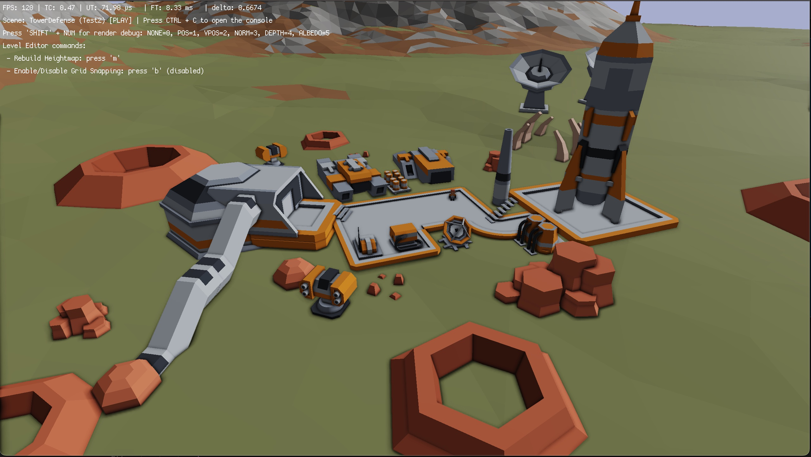

---
hide:
  - navigation
---

# **VISU** - A Modern **OpenGL** Framework for **PHP**

VISU is a collection of components and systems to make interaction with OpenGL in PHP simpler. This framework is built around the extension **[PHP-GLFW](https://github.com/mario-deluna/php-glfw)** which is requried for VISU to work.

-   :material-clock-fast:{ .lg .middle } __Install in 5 minutes__

    ---

    If you haven't installed PHP-GLFW yet, follow the installation guide for your platform.

    ---
    [:octicons-arrow-right-24: **Installation**](./getting-started/installation.md)

-   :material-lightbulb:{ .lg .middle } __PHP GameDev Tutorial__

    ---

    Everything ready to get started? Jump right into the tutorial on writing games with PHP.

    ---
    [:octicons-arrow-right-24: **Getting Started**](./getting-started/project-setup.md)

-   :material-lightbulb:{ .lg .middle } __PHP OpenGL Tutorial__

    ---

    { width="100%"}

    Want to first understand the core? Checkout the tutorial on writing OpenGL applications with PHP.

    This is not a VISU tutorial, but it will help you understand the core concepts of OpenGL, which 
    will help you develop better games with VISU.
    ---

    [:octicons-arrow-right-24: **Getting Started** (PHP-GLFW)](https://phpgl.net/getting-started/window-creation.html)

-   :material-play-circle:{ .lg .middle } __Examples & Games__

    ---

    { width="100%"}

    There is a small collection of examples and games available to get you started.

    ---

    [:octicons-arrow-right-24: **Games**](./games/0-php-games.md)

